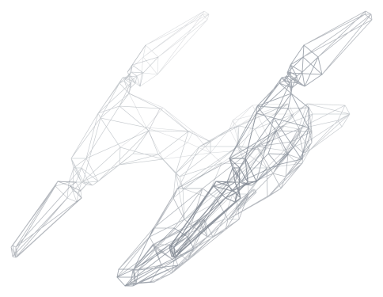

# starlancer-decomp

Reverse engineering of **StarLancer** (Digital Anvil / Microsoft, 2000; developed by Warthog),
working toward a source-level understanding of the engine and a port to modern systems.

Tools are written in Zig; `make` drives the toolchain, the extraction and the analysis.

<p align="center">
  
</p>
<p align="center">
  <sub>The Predator light fighter, read out of <code>USLF_Prd.SHP</code> by <code>sltool shp obj</code>.</sub>
</p>

> You must own a copy of the game. This repository contains no game code, assets or disc images,
> and none are ever committed: `game/`, `ghidra/projects/` and `ghidra/export/` are git-ignored.
> Work derived from the game, such as the wireframe above, is fine; the game's own files are not.

## Getting started

```bash
make setup     # JDK, Ghidra with native decompiler, GhydraMCP, into tools/
make build     # build sltool into zig-out/bin
make doctor    # report what is in place
```

Then supply the game, from your own discs. Put an image of each at `game/discs/disc1.bin` and
`disc2.bin` (a raw `.bin` of 2352-byte sectors, or an `.iso`; a `.zip` containing one works too),
and unpack them:

```bash
make game      # extract both discs, unpack the installer, decrypt the payload executable
```

That produces `game/cd1/`, `game/cd2/`, `game/install/` and `game/decrypted/LANCER.EXE`, the
readable game binary. Load it into Ghidra:

```bash
make ghidra-import    # import and auto-analyse, headless
make ghidra-export    # dump strings, functions, disassembly and C under ghidra/export/
make ghidra-gui       # open the project
```

`make help` lists every target.

## What is here

The shipped `LANCER.EXE` is a SafeDisc 1 loader; the game is the encrypted `LANCER.ICD` beside it.
`sltool safedisc` decrypts it from the files alone, with no disc access and without running the
loader, by a 32-bit key search. It also recovers the names of the `kernel32` and `user32` imports
SafeDisc hides, but not their order, which SafeDisc shuffles, so it does not write them back.

| Command | Reads | Doc |
|---|---|---|
| `sltool cd` | Raw CD images and their ISO 9660 filesystem | [disc-images](docs/formats/disc-images.md) |
| `sltool safedisc` | The protected executable | [safedisc](docs/binary/safedisc.md) |
| `sltool hog` | `.HOG` archives and their RefPack compression | [hog](docs/formats/hog.md), [refpack](docs/formats/refpack.md) |
| `sltool shp` | `.SHP` models; exports Wavefront OBJ; lists an object's components | [shp](docs/formats/shp.md) |
| `sltool spr` | `.SPR` interface sprites; exports indexed PNG | [spr](docs/formats/spr.md) |
| `sltool fat` | `.fat` sound banks; exports WAV | [fat](docs/formats/fat.md) |
| `sltool fnt` | `.fnt` fonts; renders glyph atlases | [fnt](docs/formats/fnt.md) |
| `sltool dte` | `.DTE` missions, including a disassembler for their script | [dte](docs/formats/dte.md) |
| `sltool stats` | Ship, gun, missile and pilot stat tables | [stats](docs/formats/stats.md) |

`make assets`, `models`, `sprites`, `sounds` and `fonts` run the extractors over every file; `check-models` and
`check-missions` validate them. The script VM's opcode, command and condition tables, the engine's
model tables and the player's control bindings are derived from the game binary by
`src/tools/tablegen` (`make vm-opcodes`, `make vm-commands`, `make vm-conditions`, `make
model-tables`, `make control-tables`), and `make ghidra-annotate` names and types the Ghidra
project from the Zig definitions.

Documentation index: [`docs/README.md`](docs/README.md).

## Layout

| Path | Contents |
|---|---|
| `src/formats/` | The `starlancer` module: readers for the game's formats and containers. |
| `src/lancer.zig`, `src/lancer/` | The game executable's own run-time structures. |
| `src/tools/sltool/` | `sltool`, the command line front end. |
| `src/tools/tablegen/` | Derives the engine's static tables from the game binary: the script VM's, and its model tables. |
| `src/tools/ghidragen/` | Writes the names and data types the Ghidra scripts apply. |
| `mk/`, `scripts/` | Makefile fragments and their helpers. |
| `ghidra/scripts/` | Ghidra scripts, run headless by `make`. |
| `ghidra/names/` | Names and types for the payload's identified functions and data, applied by `make ghidra-annotate`. |
| `docs/` | Reference documentation. |
| `tools/`, `game/`, `references/` | Git-ignored: toolchain, game files, other projects read for reference. |

## License

Copyright 2026 the OpenReliant contributors.

The code is licensed under the [Mozilla Public License 2.0](LICENSE): it can be used in any
project, open or not, but changes to its files are shared under the same license. The
documentation under `docs/` is licensed under
[Creative Commons Attribution-ShareAlike 4.0](docs/LICENSE).

StarLancer, its code and its assets belong to their owners, and neither license covers them. This
repository holds none of the game's files, but parts of it reproduce what the game contains, and
those parts are not ours to license: the tables transcribed from the game executable carry names
and descriptions the game's developers wrote, and `docs/images/predator-wireframe.svg` is drawn
from the game's own model.

## Related projects

Independent reverse engineering of the same game, read for cross-reference. No code from them is
used here.

- [LordBlacksun/Starlancer-OSS](https://github.com/LordBlacksun/Starlancer-OSS): format
  documentation, modern-Windows patches and editors, in Python.
- [mini/starlancereditor](https://src.ug.gg/mini/starlancereditor): a .NET library and tools for
  the archive, mission and save formats.
- [DMJC/neoslancer](https://github.com/DMJC/neoslancer) and
  [DMJC/StarLanceDecomp](https://github.com/DMJC/StarLanceDecomp): a C++/SDL2 port and its
  reverse-engineering notes.
